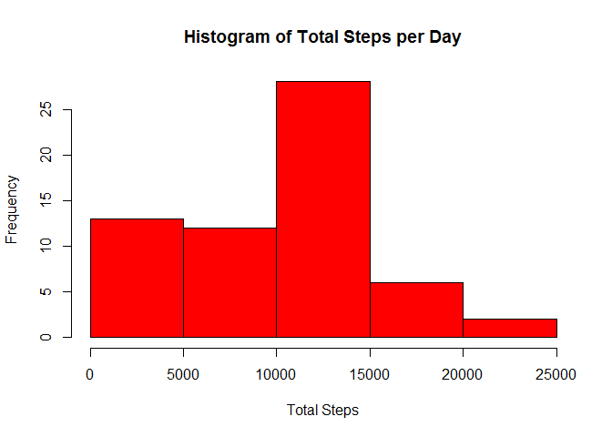
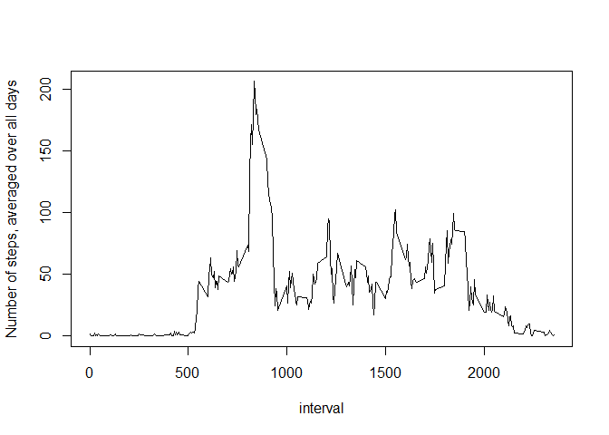
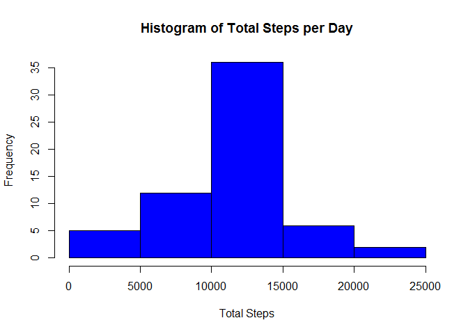
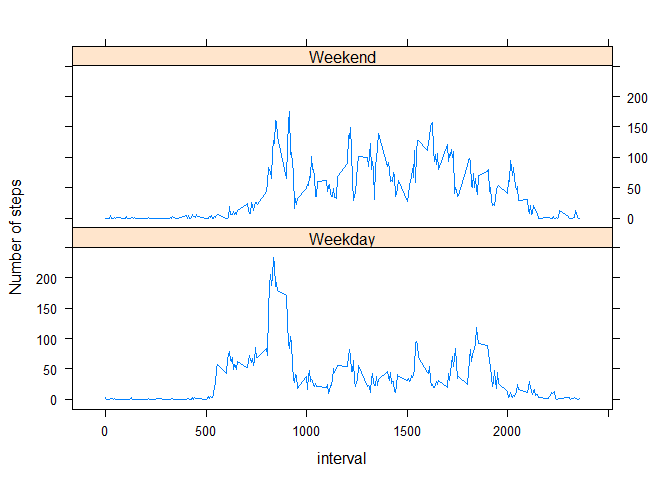

# Reproducible Research: Peer Assessment 1

## Loading and preprocessing the data

This is the code I used for loading and preprocessing the data. First I unzip the activity.zip file from the repo and store it as 'data'. This was loaded into data by read.csv. The only processing I did was changing the dates from character to POSIXt, using the lubridate package.


```r
  data<-unzip("activity.zip")

  data<-read.csv(data, na.strings="NA")
  library(lubridate)
```

```
## Warning: package 'lubridate' was built under R version 3.1.3
```

```r
  data$date<-ymd(data$date)
```

## What is mean total number of steps taken per day?

### Make a histogram of the total number of steps taken each day


```r
  library(plyr)
```

```
## 
## Attaching package: 'plyr'
## 
## The following object is masked from 'package:lubridate':
## 
##     here
```

```r
  sumdata<-ddply(data, .(date), summarise, totalsteps=sum(steps, na.rm=TRUE))
  hist(sumdata$totalsteps, main="Histogram of Total Steps per Day", col="red", xlab="Total Steps")
```

 

### Calculate and report the mean and median total number of steps taken per day


```r
  mean<-mean(sumdata$totalsteps, na.rm=TRUE)
```

```r
  median<-median(sumdata$totalsteps, na.rm=TRUE)
```

The mean total number of steps taken per day is 9354.2295082, the median is 10395.

## What is the average daily activity pattern?

### Make a time series plot (i.e. type = "l") of the 5-minute interval (x-axis) and the average number of steps taken, averaged across all days (y-axis)


```r
  intervaldata<-ddply(data, .(interval), summarise, averagesteps=mean(steps, na.rm=TRUE))
  plot(intervaldata, ylab="Number of steps, averaged over all days", type="l")
```

 

### Which 5-minute interval, on average across all the days in the dataset, contains the maximum number of steps?


```r
  max<-max(intervaldata$averagesteps)
  index<-which(intervaldata$averagesteps==max)
  maxnumber<-intervaldata$interval[index]
```

The 5 minute interval that contains the maximum number of steps on average across all the days in the dataset is interval 835.

## Imputing missing values

### Calculate and report the total number of missing values in the dataset (i.e. the total number of rows with NAs)


```r
numberNA<-sum(is.na(data$steps))
```

The total number of missing values in the dataset is 2304.

### Devise a strategy for filling in all of the missing values in the dataset.

I made the choice to fill the missing values with the mean number of steps for that interval of the day, because it seemed like some days only had NA's. It seemed most logical to just fill the intervals with their respective averages because of that.

### Create a new dataset that is equal to the original dataset but with the missing data filled in.


```r
  newdata<-ddply(data, .(interval), mutate, steps=ifelse(is.na(steps), mean(steps, na.rm=TRUE), steps))
```

### Make a histogram of the total number of steps taken each day


```r
  newsumdata<-ddply(newdata, .(date), summarise, totalsteps=sum(steps, na.rm=TRUE))
  hist(newsumdata$totalsteps, main="Histogram of Total Steps per Day", col="blue", xlab="Total Steps")
```

 

###  Report the mean and median total number of steps taken per day

```r
  newmean<-mean(newsumdata$totalsteps)
```

```r
  newmedian<-median(newsumdata$totalsteps)
```

In the new dataset with the missing data filled in, the mean total number of steps is 1.0766189\times 10^{4} and the median is 1.0766189\times 10^{4}.
So these values do differ from the first calculation without the missing data filled in. The difference is these numbers are bigger (which is to be expected, because in the first calculation days that were in part or totally NA  had very low scores, while now they are probably closer to average scores), and the mean and median are now the same. You would expect them to come closer together, because the distribution is less skewed this way (which is very clear looking at the histograms). I think they are exactly the same now because some days were total NA's, and in my first calculations, because I ignored the NAs with na.rm=TRUE in the sum function, one whole day with all NAs is given as 0 total steps. All those days (8 in total), were now filled with the mean of all the days that had values, which is a higher mean than in the first calculation, because I used the mean per interval. So anyway, because this is the mean and filled in 8 slots out of 61, it is now the mean and the median.
(This is not a very well written explanation, I know, but you probably get it because you did the assignment as well :))
So the impact of the missing data is quite big: the histogram is skewed, while with the missing data filled in it seems more like a normal distribution.

## Are there differences in activity patterns between weekdays and weekends?

### Create a new factor variable in the dataset with two levels - "weekday" and "weekend" indicating whether a given date is a weekday or weekend day.

This is probably not the best code... But it does work! Just for your information levels(data$weekorweekend) before calling it "Weekday" or "Weekend" gives you: "Friday"    "Monday"    "Saturday"  "Sunday"    "Thursday"  "Tuesday"   "Wednesday".


```r
  data$weekorweekend<-as.factor(weekdays(data$date))
  levels(data$weekorweekend)<-c("Weekday", "Weekday", "Weekend", "Weekend", "Weekday", "Weekday", "Weekday")
```

### Make a panel plot containing a time series plot (i.e. type = "l") of the 5-minute interval (x-axis) and the average number of steps taken, averaged across all weekday days or weekend days (y-axis). See the README file in the GitHub repository to see an example of what this plot should look like using simulated data.


```r
  library(lattice)
  intervalsteps<-ddply(data, .(weekorweekend, interval), summarise, averagesteps=mean(steps, na.rm=TRUE))
  xyplot(averagesteps~interval|weekorweekend, intervalsteps, type="l", layout=c(1,2), ylab="Number of steps")
```

 
